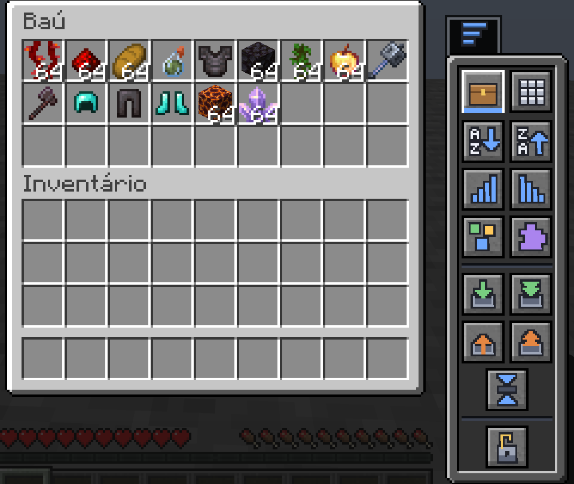
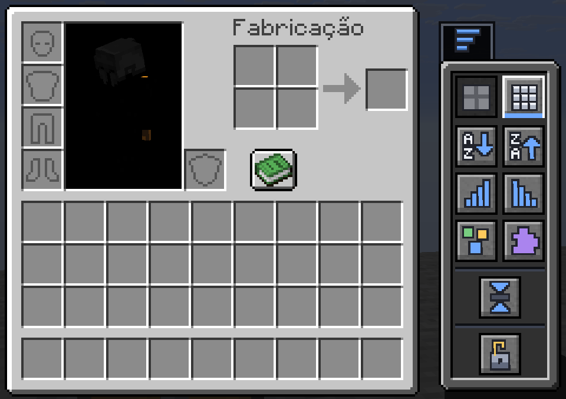

<p align="center">
  
</p>

<h1 align="center">Smart Inventory</h1>

<p align="center">
  A Fabric mod that adds a compact, vanilla-styled panel to container screens for
  sorting, compacting, and moving items — without ever leaving the screen.
</p>

<p align="center">
  
  
  
  <a href="LICENSE"></a>
  <a href="https://github.com/guilhermegsr/smart-storage/actions/workflows/build.yml"></a>
</p>

## Features

- **Sort** the container or your inventory by name (A–Z / Z–A), quantity, category, or mod.
- **Transfer** in one click: deposit matching / deposit all, withdraw matching / withdraw all.
- **Compact** loose stacks of the same item.
- **Container-aware**: detects chests, barrels, ender chests, shulker boxes, hoppers,
  dispensers and droppers, and shows the matching icon.
- **Protect or include** your hotbar when organizing.
- **Fully localized** — the UI follows your game language (English and Portuguese included;
  more can be added by dropping in a lang file). Name sorting respects your language even on servers.
- **Server-authoritative and safe** on multiplayer; degrades gracefully (with a notice) on servers
  that don't have the mod.

## Screenshots

<table width="100%">
  <tr>
    <td align="center" valign="top" width="50%">
      <br>
      <sub>With a container open — sort, deposit, withdraw, compact</sub>
    </td>
    <td align="center" valign="top" width="50%">
      <br>
      <sub>On your own inventory — sort and compact anywhere</sub>
    </td>
  </tr>
</table>

## Requirements

- Minecraft 26.1.2
- [Fabric Loader](https://fabricmc.net/use/installer/) 0.19.2+
- [Fabric API](https://modrinth.com/mod/fabric-api)
- Java 25+

## Installation

1. Install Fabric Loader for Minecraft 26.1.2.
2. Drop **Fabric API** and **Smart Inventory** into your `mods` folder.
3. Launch the game. Open any container (or your inventory) and click the side tab to open the panel.

## Building from source

```sh
./gradlew build
```

The built jar is written to `build/libs/`.

## License

Released under the [MIT License](LICENSE).
